---

## About

I build AI-native systems that eliminate manual work — AI agents, local AI, voice assistants, browser automation, content pipelines, and full-stack SaaS. Everything ships. Everything runs. No prototypes, no mock demos.

- Building [**Atlas**](https://github.com/Auto-Atlas) — your AI chief of staff: local full-duplex voice (Whisper + Ollama + Kokoro), real tools, $0/month — [watch it run](https://www.youtube.com/shorts/C1UZbEMNQ_k)
- Building [**BookingBot**](https://github.com/JonDipilato/bookingbot-saas) — AI-powered SaaS booking automation
- Teaching local AI on [**NoCode Abode**](https://www.youtube.com/@NoCodeAbode) — running frontier-class AI on your own GPU
- Daily drivers: Claude Code, Codex, Ollama, llama.cpp, MCP servers, ElevenLabs, ComfyUI

---

## Tech Stack

**Languages**

**AI Coding Agents**

**Local AI**

**Voice & Automation**

**Infrastructure & Tools**

---

## Featured Projects

  

  

 

| Live & Deployed | |
|---|---|
| [**Email Machine**](https://www.dipilatosystems.biz/) | Fully automated outbound email system — running in production |

---

## Contribution Snake

<picture>
  <source media="(prefers-color-scheme: dark)" srcset="https://raw.githubusercontent.com/JonDipilato/JonDipilato/output/github-snake-dark.svg" />
  <source media="(prefers-color-scheme: light)" srcset="https://raw.githubusercontent.com/JonDipilato/JonDipilato/output/github-snake.svg" />
  
</picture>

---

## Trophies

---

## GitHub Stats

---

## Activity

---

## Recent Activity

<!--START_SECTION:activity-->
1. 💪 Opened PR [#1](https://github.com/Auto-Atlas/Auto-Atlas/pull/1) in [Auto-Atlas/Auto-Atlas](https://github.com/Auto-Atlas/Auto-Atlas)
2. 🎉 Merged PR [#1](https://github.com/Auto-Atlas/atlas-ios/pull/1) in [Auto-Atlas/atlas-ios](https://github.com/Auto-Atlas/atlas-ios)
3. 🎉 Merged PR [#1](https://github.com/Auto-Atlas/atlas-glasses/pull/1) in [Auto-Atlas/atlas-glasses](https://github.com/Auto-Atlas/atlas-glasses)
4. 💪 Opened PR [#1](https://github.com/Auto-Atlas/atlas-glasses/pull/1) in [Auto-Atlas/atlas-glasses](https://github.com/Auto-Atlas/atlas-glasses)
5. 🎉 Merged PR [#1](https://github.com/Auto-Atlas/atlas-watch/pull/1) in [Auto-Atlas/atlas-watch](https://github.com/Auto-Atlas/atlas-watch)
6. 💪 Opened PR [#1](https://github.com/Auto-Atlas/atlas-ios/pull/1) in [Auto-Atlas/atlas-ios](https://github.com/Auto-Atlas/atlas-ios)
<!--END_SECTION:activity-->

---

## Latest on YouTube

**[NoCode Abode](https://www.youtube.com/@NoCodeAbode)** — local AI on your own GPU

<!-- BEGIN YT-NOCODEABODE -->
[")](https://www.youtube.com/watch?v=fUcEdBRyd1w)
[ #localai")](https://www.youtube.com/shorts/C1UZbEMNQ_k)

<!-- END YT-NOCODEABODE -->

**[Jon DiPilato](https://www.youtube.com/@JonDiPilato)** — AI automation for local business

<!-- BEGIN YT-JONDIPILATO -->

[")](https://www.youtube.com/watch?v=xO4CDu1ou-Y)
<!-- END YT-JONDIPILATO -->

---

> *"If a human does it twice, I automate it."*

